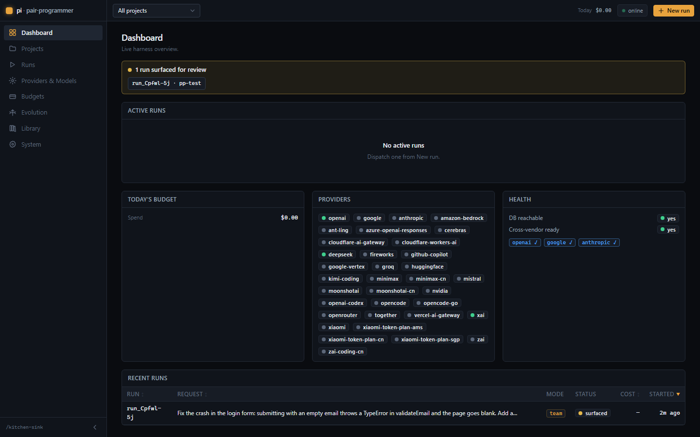
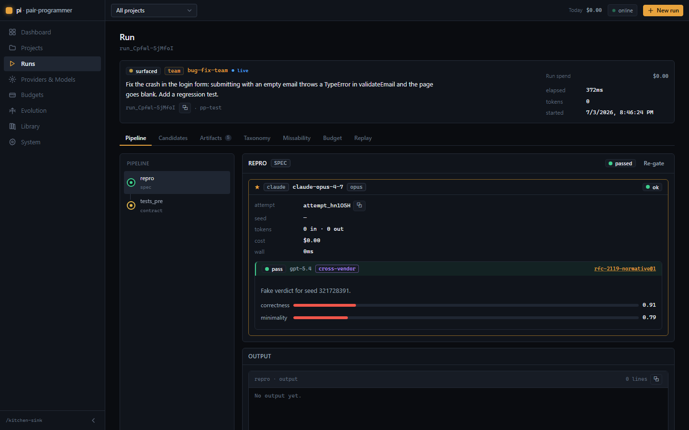
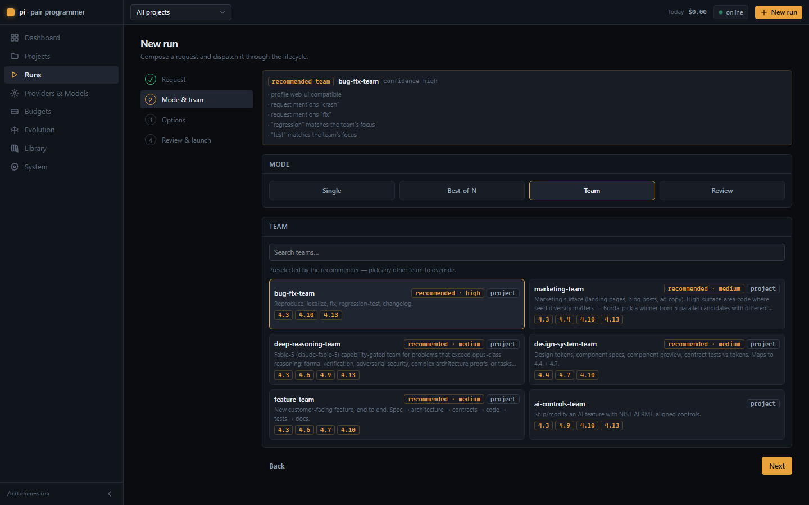
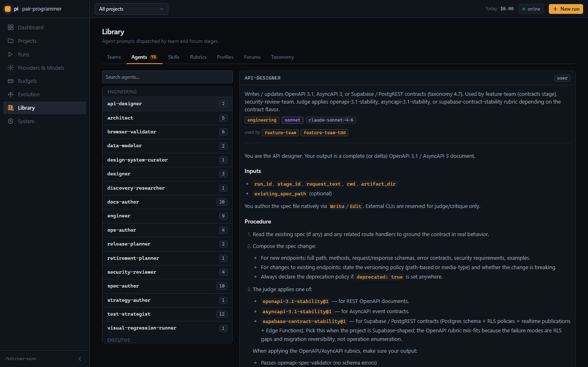
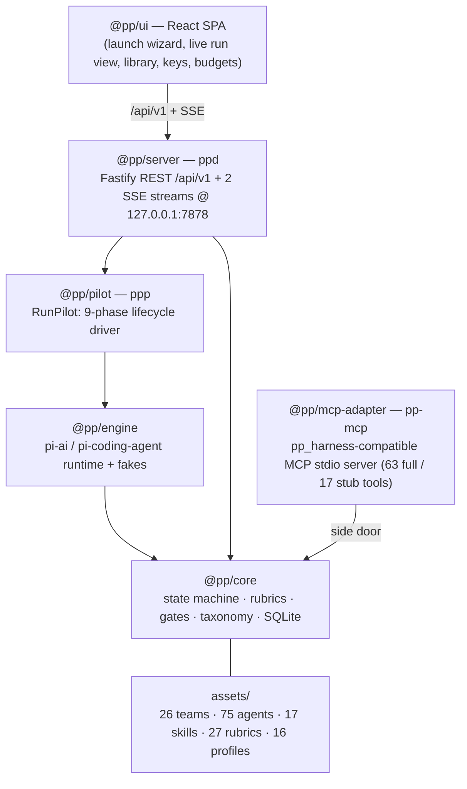

# pi-pp-platform

[](https://github.com/lebobo88/pi-pp-platform/actions/workflows/ci.yml)
[](LICENSE)
[](package.json)

**Pair-programmer, re-hosted on the pi runtime.** This is a faithful port of the
`pair-programmer` multi-agent code-generation harness that
runs entirely on [`@earendil-works/pi-*`](https://www.npmjs.com/package/@earendil-works/pi-ai)
**0.80.3** — with **zero dependence on the Claude Code, Gemini, Codex, or Copilot
CLIs**. Generation and cross-provider judging happen through the pi model APIs
instead of shelling out to vendor CLIs, and the whole platform is driven from a
web UI plus a small set of local binaries.

- **Same harness, new runtime.** The orchestration state machine, rubrics,
  gates, taxonomy, best-of-N, TDD/validator gates, missability checks, and
  master-plan patching are ported wholesale into `@pp/core`. Behavior and
  invariants are preserved (Reflexion ×1, cross-vendor judging, capability
  gates, …).
- **No sub-CLIs.** `@pp/engine` wraps the pi model + coding-agent APIs directly
  and ships deterministic fakes for offline/dev runs.
- **A real product surface.** A Fastify control-plane server (`ppd`) exposes a
  typed REST + SSE API, and a React SPA gives you project management, a run
  launch wizard, a live run view, provider key management, budgets, evolution
  review, and system health.

## Features

- **Four run modes** — `single`, `team` (26 specialized team pipelines),
  `best_of` (2–8 parallel candidates, winner picked by Borda-count judging),
  and `review` (10 governance forums: framing, scope, design, architecture,
  threat, …).
- **Cross-provider judging** — generated work is gated by judges from a
  *different* vendor, with Reflexion ×1 retry, re-gate, and abort controls.
- **Budgets with tripwires** — per-run/day/model cost tracking, tripwire
  downgrades, and hard caps; doctor probes (with optional critique smoke test)
  and reproducible replay bundles.
- **7-tab library** — Teams (26), Agents (75 role prompts with categories and
  team cross-references), Skills (17 — a first-class registry with
  project → user → builtin resolution and budgeted prompt injection), Rubrics
  (27), Profiles (16), Forums (10), Taxonomy (16 SDLC sections).
- **Profile auto-detection + team recommendation** — the harness detects the
  right project profile from the repo, and a deterministic scorer recommends a
  team; the launch wizard preselects it with confidence and reasons.
- **Dynamic 35-provider catalog** — providers, models, and verified pricing
  sourced from pi's builtin catalog; add a key for any provider and use it as
  generator or judge. Pricing mirrors are generated, not hand-maintained.
- **Evolution (autogenesis)** — the harness proposes improvements to its own
  rubrics/teams/profiles; approved proposals commit as project-scoped
  overrides with snapshots, rollback, and an audit trail.
- **Auth** — optional `PP_API_TOKEN` bearer auth with a UI token gate and
  tokenized SSE; provider keys are stored write-only.
- **MCP adapter** — a `pp_harness`-compatible stdio server (63 full / 17 stub
  tools) so external MCP hosts can read and drive the harness.

## Screenshots

| Dashboard | Live run |
| --- | --- |
|  |  |

| Launch wizard (team recommendation) | Library (75 agent prompts) |
| --- | --- |
|  |  |

## Architecture



Dependency direction is **server → pilot → engine → core**. Only `@pp/engine`
imports the pi packages, so everything above it is engine-agnostic. The
`@pp/mcp-adapter` is a side door: it exposes the harness read/record surface to
external MCP hosts without going through the server.

| Path | Package | Role | Binary |
| --- | --- | --- | --- |
| `packages/core` | `@pp/core` | Orchestration state machine, SQLite schema, rubrics, gates, taxonomy, best-of-N | — |
| `packages/engine` | `@pp/engine` | pi-ai / pi-coding-agent runtime — generate, critique, tool guards, doctor probes, deterministic fakes | — |
| `packages/pilot` | `@pp/pilot` | `RunPilot` — the in-process 9-phase lifecycle driver | `ppp` |
| `packages/server` | `@pp/server` | Fastify REST `/api/v1` + two SSE streams on `127.0.0.1:7878` | `ppd` |
| `packages/mcp-adapter` | `@pp/mcp-adapter` | pp_harness-compatible MCP stdio server over `@pp/core` | `pp-mcp` |
| `ui` | `@pp/ui` | React 18 + Vite 6 + Tailwind v4 SPA (served by `ppd`) | — |
| `shared` | — | `api-types.ts` — the wire contract shared by server + UI | — |
| `assets` | — | Teams, agents, skills, rubrics, profiles, taxonomy blueprint, provider catalog | — |

## Quickstart

```bash
# 1. Install (pnpm 9, Node ≥ 22.19)
pnpm install

# 2. Build everything
pnpm build

# 3a. Demo mode — real UI + real server driven by the fake engine (no API keys):
pnpm demo            # → http://127.0.0.1:7878

# 3b. UI-only mock mode — in-browser mock daemon replays a scripted, animated run:
VITE_MOCK=1 pnpm -F @pp/ui dev      # → http://localhost:5273

# 3c. Full server (serves the built UI):
pnpm start           # builds, then boots ppd on http://127.0.0.1:7878
```

Additional run modes:

```bash
pnpm dev            # fake-engine API + Vite HMR (no keys)         → http://localhost:5273
pnpm serve          # PRODUCTION: real pi engine, persistent DB, PP_HOST/token gate
pnpm validate:live  # REAL end-to-end: gen (one provider) + judge (another). Needs keys.
docker compose up   # containerized (see docs/DEPLOY.md)
```

Provider API keys can be set from the UI (**Providers & Models → Set key**,
write-only) for any of pi's 35 providers, or through the engine's credential
store / env vars. Cross-provider judging needs ≥2 keyed providers; with one it
surfaces gates for human review, and with none it still runs in demo/mock mode
(see [INSTALL.md](docs/INSTALL.md#provider-keys)).

## Providers & models

Providers, their models, and pricing are sourced from **pi's builtin catalog
(35 providers)** — OpenAI, Anthropic, Google, DeepSeek, xAI, Mistral, Groq, and
more. A governance catalog (`packages/core/catalog.json` + a
`~/.pi-pp-platform/catalog.json` override) controls which providers are
enabled, the generation ladders, and the judge pool; the pricing mirrors
(`prices.json`) are **generated** by `scripts/generate-catalog-providers.mjs`
and verified against published pricing. Any keyed provider can serve as a
**generator** or **judge**, with per-provider model refresh from the UI.
Cross-provider judging only ever routes to providers you've keyed.

> Coding stages need a model that reliably calls file-editing tools (Claude,
> OpenAI, and similar). Authoring/spec/design stages work with any capable
> model; some models answer conversationally and won't produce a diff for
> agentic coding.

## Documentation

| Doc | What it covers |
| --- | --- |
| [docs/INSTALL.md](docs/INSTALL.md) | Full setup — prerequisites, provider keys, environment variables |
| [docs/USER_GUIDE.md](docs/USER_GUIDE.md) | Screen-by-screen tour and the run-lifecycle explainer |
| [docs/DEPLOY.md](docs/DEPLOY.md) | Hardened + containerized deployment (Dockerfile, compose, token gate) |
| [docs/VALIDATION.md](docs/VALIDATION.md) | Live end-to-end validation harness (`pnpm validate:live`) |
| [docs/DEMO.md](docs/DEMO.md) | Offline demo walkthrough with the fake engine |

## Status

Status: pre-1.0.

## Contributing & Security

Contributions are welcome — see [CONTRIBUTING.md](CONTRIBUTING.md). To report a
vulnerability, see [SECURITY.md](SECURITY.md).

## License

[MIT](LICENSE).
