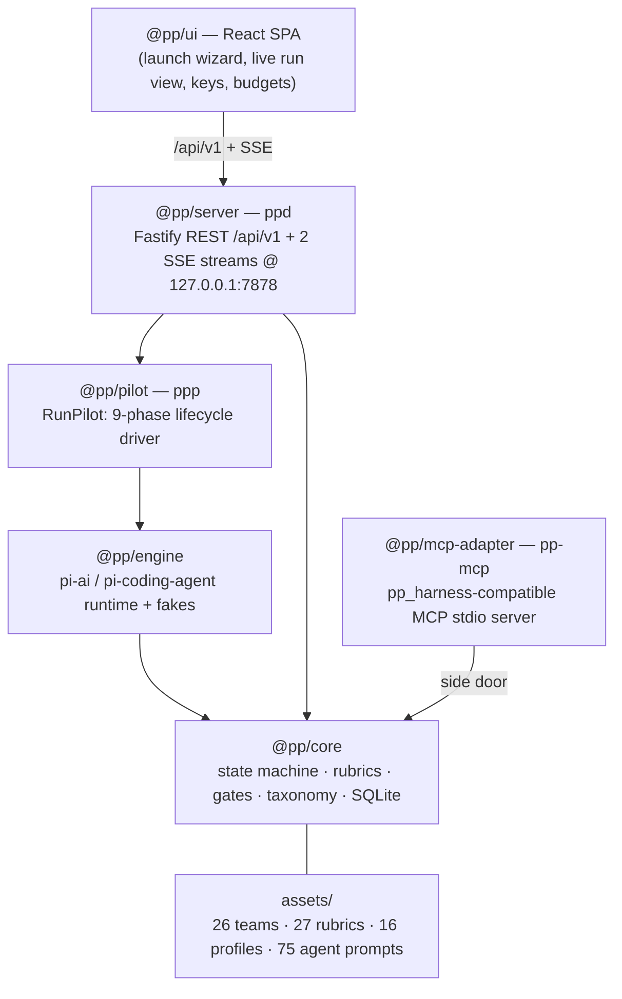

# pi-pp-platform

**Pair-programmer, re-hosted on the pi runtime.** This is a faithful port of the
`pair-programmer` multi-agent code-generation harness that
runs entirely on [`@earendil-works/pi-*`](https://www.npmjs.com/package/@earendil-works/pi-ai)
**0.80.3** — with **zero dependence on the Claude Code, Gemini, Codex, or Copilot
CLIs**. Generation and cross-vendor judging happen through the pi model APIs
(OpenAI, Google, Anthropic) instead of shelling out to vendor CLIs, and the whole
platform is driven from a web UI plus a small set of local binaries.

> Status: pre-1.0, under active milestone development. See the
> [milestone status](#milestone-status) table — sections that depend on
> in-flight work are marked `TODO(M5d/M7/M8)` throughout these docs.

## What it is

- **Same harness, new runtime.** The orchestration state machine, rubrics,
  gates, taxonomy, best-of-N, TDD/validator gates, missability checks, and
  master-plan patching are ported wholesale from pair-programmer into
  `@pp/core`. Behavior and invariants are preserved (Reflexion ×1, cross-vendor
  judging, the fable-tier capability gate, …).
- **No sub-CLIs.** The old codex/gemini/copilot CLI bridges are gone. `@pp/engine`
  wraps the pi model + coding-agent APIs directly and ships deterministic fakes
  for offline/dev runs.
- **A real product surface.** A Fastify control-plane server (`ppd`) exposes a
  typed REST + SSE API, and a React SPA gives you project management, a run
  launch wizard, a live run view, provider key management, budgets, evolution
  review, and system health.

## Architecture



Dependency direction is **server → pilot → engine → core**. Only `@pp/engine`
imports the pi packages, so everything above it is engine-agnostic. The
`@pp/mcp-adapter` is a side door: it exposes the harness read/record surface to
external MCP hosts (the Hydra gateway, TheEights, any MCP client) without going
through the server.

## Packages

| Path | Package | Role | Binary |
| --- | --- | --- | --- |
| `packages/core` | `@pp/core` | Orchestration state machine, SQLite schema, rubrics, gates, taxonomy, best-of-N | — |
| `packages/engine` | `@pp/engine` | pi-ai / pi-coding-agent runtime — generate, critique, tool guards, doctor probes, deterministic fakes | — |
| `packages/pilot` | `@pp/pilot` | `RunPilot` — the in-process 9-phase lifecycle driver | `ppp` |
| `packages/server` | `@pp/server` | Fastify REST `/api/v1` + two SSE streams on `127.0.0.1:7878` | `ppd` |
| `packages/mcp-adapter` | `@pp/mcp-adapter` | pp_harness-compatible MCP stdio server over `@pp/core` | `pp-mcp` |
| `ui` | `@pp/ui` | React 18 + Vite 6 + Tailwind v4 SPA (served by `ppd`) | — |
| `shared` | — | `api-types.ts` — the hand-maintained wire contract shared by server + UI | — |
| `assets` | — | Ported teams, rubrics, profiles, agent prompts, taxonomy blueprint | — |

## Quickstart

```bash
# 1. Install (pnpm 9, Node ≥ 22.19)
pnpm install

# 2. Build everything
pnpm -r build

# 3a. Demo the UI with no server or API keys — the in-browser mock daemon
#     serves fixtures and replays a scripted, animated run:
VITE_MOCK=1 pnpm -F @pp/ui dev      # → http://localhost:5273

# 3b. Or run the real control-plane server (serves the built UI when PP_UI_DIST
#     points at ui/dist):
node packages/server/dist/bin/ppd.js         # → http://127.0.0.1:7878
#     (installed as the `ppd` binary once packages are linked)
```

Provider API keys can be set from the UI (**Providers & Models → Set key**,
write-only) or through the engine's credential store. Full cross-vendor judging
needs keys for all three vendors (OpenAI, Google, Anthropic); with fewer, the
harness degrades gracefully (see [INSTALL.md](docs/INSTALL.md#provider-keys)).

The `ppp` binary (`@pp/pilot`) drives a run from the command line; `ppd`
(`@pp/server`) hosts the API + UI. See [docs/INSTALL.md](docs/INSTALL.md) for the
full setup and [docs/USER_GUIDE.md](docs/USER_GUIDE.md) for a screen-by-screen
tour and the run-lifecycle explainer.

> `TODO(M5d)`: run **control** (launch / abort / retry / gate) over REST is not
> wired to the pilot yet — the server returns `501` for those routes until M5d.
> Read-only views, library, budgets, and provider key management are live. The
> UI is fully functional today against `VITE_MOCK=1`.

## Milestone status

| Milestone | Scope | Commit | State |
| --- | --- | --- | --- |
| M1 | Scaffold workspace; port daemon as `@pp/core` | `4d58719` | ✅ done |
| M2 | `@pp/engine` — pi generate/critique/doctor + fakes | `11a3059` | ✅ done |
| M3 | `@pp/pilot` — RunPilot 9-phase lifecycle + `ppp` | `4f55439` | ✅ done |
| M5a | UI foundation — contract, tokens, primitives, SSE/query layer, mock API | `b467fe2` | ✅ done |
| M5b | UI read-only feature screens + animated run view | `59cf230` | ✅ done |
| M5c | `@pp/server` — REST/SSE foundation, schema v8, key mgmt | `10974b9` | ✅ done |
| M6 / M6.1 | UI control plane — wizard, run actions, keys, evolution, caps | `2a1d2a7` / `ffb0ec0` | ✅ done |
| M7a | `@pp/mcp-adapter` — pp_harness MCP server | `6594efc` | ✅ done |
| M8a | Parity matrix + audit scaffold; ecosystem guard (default off) | `1efc912` | ✅ done |
| M4 | Best-of-N + teams + forums + TDD/validators end-to-end | — | 🚧 `TODO(M4)` |
| M5d | Pilot ↔ server run-control wiring (launch/abort/retry/gate) | — | 🚧 `TODO(M5d)` |
| M7 | Hooks parity (29), ecosystem, evolution LLM, visual/browser | — | 🚧 `TODO(M7)` |
| M8 | Parity audit close-out, prompt port (75), docs | — | 🚧 `TODO(M8)` |

(Commit refs are from `git log`; the table is a snapshot and the final M8 pass
will refresh it.)

## License

TODO(M8): license not yet declared.
