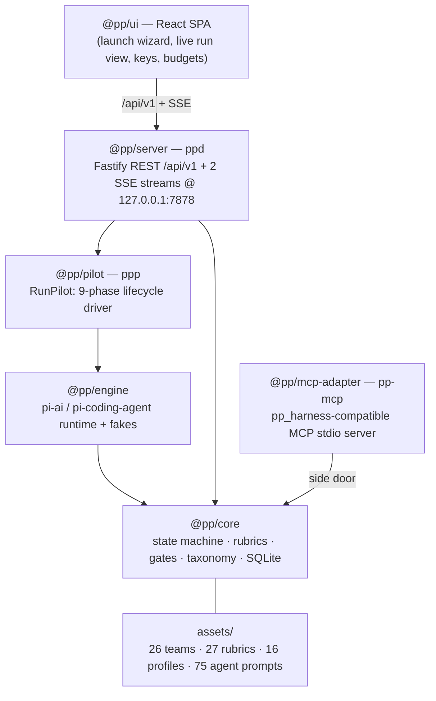

# pi-pp-platform

**Pair-programmer, re-hosted on the pi runtime.** This is a faithful port of the
`pair-programmer` multi-agent code-generation harness that
runs entirely on [`@earendil-works/pi-*`](https://www.npmjs.com/package/@earendil-works/pi-ai)
**0.80.3** — with **zero dependence on the Claude Code, Gemini, Codex, or Copilot
CLIs**. Generation and cross-**provider** judging happen through the pi model APIs
instead of shelling out to vendor CLIs, and the whole platform is driven from a
web UI plus a small set of local binaries.

> Status: pre-1.0. Milestones M1–M8 are complete. Since then: a **dynamic
> provider/model catalog** (configure keys + models for any of pi's ~35
> providers — OpenAI, Anthropic, Google, DeepSeek, xAI, Mistral, Groq, …, sourced
> live from pi), a **hardened + containerized deploy** path
> ([`docs/DEPLOY.md`](docs/DEPLOY.md)), a **real live end-to-end validation**
> harness ([`docs/VALIDATION.md`](docs/VALIDATION.md)), a real Playwright
> browser-validation drive, and CI. See [milestone status](#milestone-status).

## Providers & models (dynamic catalog)

Providers, their models, and pricing are sourced **live from pi's builtin
catalog (~35 providers)** — nothing is hand-maintained. A governance catalog
(`packages/core/catalog.json` + a `~/.pi-pp-platform/catalog.json` override)
controls which providers are enabled, the generation ladders, and the judge
pool. In the UI's **Providers & Models** page you can add a key for any provider
(stored write-only), pick any provider/model as a **generator** or **judge**,
and the model catalog + pricing populate automatically. Cross-provider judging
only ever routes to providers you've keyed.

> Coding stages need a model that reliably calls file-editing tools (Claude,
> OpenAI/codex, and similar). Authoring/spec/design stages work with any capable
> model; some models answer conversationally and won't produce a diff for
> agentic coding.

## What it is

- **Same harness, new runtime.** The orchestration state machine, rubrics,
  gates, taxonomy, best-of-N, TDD/validator gates, missability checks, and
  master-plan patching are ported wholesale from pair-programmer into
  `@pp/core`. Behavior and invariants are preserved (Reflexion ×1, cross-vendor
  judging, the fable-tier capability gate, …).
- **No sub-CLIs.** The old codex/gemini/copilot CLI bridges are gone. `@pp/engine`
  wraps the pi model + coding-agent APIs directly and ships deterministic fakes
  for offline/dev runs.
- **A real product surface.** A Fastify control-plane server (`ppd`) exposes a
  typed REST + SSE API, and a React SPA gives you project management, a run
  launch wizard, a live run view, provider key management, budgets, evolution
  review, and system health.

## Architecture



Dependency direction is **server → pilot → engine → core**. Only `@pp/engine`
imports the pi packages, so everything above it is engine-agnostic. The
`@pp/mcp-adapter` is a side door: it exposes the harness read/record surface to
external MCP hosts (the Hydra gateway, TheEights, any MCP client) without going
through the server.

## Packages

| Path | Package | Role | Binary |
| --- | --- | --- | --- |
| `packages/core` | `@pp/core` | Orchestration state machine, SQLite schema, rubrics, gates, taxonomy, best-of-N | — |
| `packages/engine` | `@pp/engine` | pi-ai / pi-coding-agent runtime — generate, critique, tool guards, doctor probes, deterministic fakes | — |
| `packages/pilot` | `@pp/pilot` | `RunPilot` — the in-process 9-phase lifecycle driver | `ppp` |
| `packages/server` | `@pp/server` | Fastify REST `/api/v1` + two SSE streams on `127.0.0.1:7878` | `ppd` |
| `packages/mcp-adapter` | `@pp/mcp-adapter` | pp_harness-compatible MCP stdio server over `@pp/core` | `pp-mcp` |
| `ui` | `@pp/ui` | React 18 + Vite 6 + Tailwind v4 SPA (served by `ppd`) | — |
| `shared` | — | `api-types.ts` — the hand-maintained wire contract shared by server + UI | — |
| `assets` | — | Ported teams, rubrics, profiles, agent prompts, taxonomy blueprint | — |

## Quickstart

```bash
# 1. Install (pnpm 9, Node ≥ 22.19)
pnpm install

# 2. Build everything
pnpm -r build

# 3a. Demo mode — real UI + real server driven by the fake engine (no API keys):
#     builds ui + server and boots ppd with PP_LLM=fake so you can launch a run
#     end to end offline.
pnpm demo            # → http://127.0.0.1:7878

# 3b. UI-only mock mode — the in-browser mock daemon serves fixtures and replays
#     a scripted, animated run (no server):
VITE_MOCK=1 pnpm -F @pp/ui dev      # → http://localhost:5273

# 3c. Full server (serves the built UI when PP_UI_DIST points at ui/dist):
pnpm start           # builds, then boots ppd on http://127.0.0.1:7878
```

Provider API keys can be set from the UI (**Providers & Models → Set key**,
write-only) for any of pi's ~35 providers, or through the engine's credential
store / env vars. Cross-provider judging needs ≥2 keyed providers; with one it
surfaces gates for human review, and with none it still runs in demo/mock mode
(see [INSTALL.md](docs/INSTALL.md#provider-keys)).

Additional run modes:

```bash
pnpm dev            # fake-engine API + Vite HMR (no keys)         → http://localhost:5273
pnpm serve          # PRODUCTION: real pi engine, persistent DB, PP_HOST/token gate
pnpm validate:live  # REAL end-to-end: gen (one provider) + judge (another). Needs keys.
docker compose up   # containerized (see docs/DEPLOY.md)
```

The `ppp` binary (`@pp/pilot`) drives a run from the command line; `ppd`
(`@pp/server`) hosts the API + UI. See [docs/INSTALL.md](docs/INSTALL.md) for the
full setup and [docs/USER_GUIDE.md](docs/USER_GUIDE.md) for a screen-by-screen
tour and the run-lifecycle explainer.

Run **control** (launch / abort / retry / gate) is live over REST via the
in-process `RunSupervisor` (concurrency cap, FIFO queue, budget tripwires), and
the pilot's event bus is bridged to SSE so the run view animates in real time.

## Milestone status

| Milestone | Scope | Commit | State |
| --- | --- | --- | --- |
| M1 | Scaffold workspace; port daemon as `@pp/core` | `4d58719` | ✅ done |
| M2 | `@pp/engine` — pi generate/critique/doctor + fakes | `11a3059` | ✅ done |
| M3 | `@pp/pilot` — RunPilot 9-phase lifecycle + `ppp` | `4f55439` | ✅ done |
| M4 | Best-of-N + teams (26) + forums (10) + TDD/validator gates | `9699abb` | ✅ done |
| M5a–b | UI foundation + read-only feature screens + animated run view | `b467fe2` / `59cf230` | ✅ done |
| M5c | `@pp/server` — REST/SSE foundation, schema v8, key mgmt | `10974b9` | ✅ done |
| M5d | Run-control live — `RunSupervisor` (concurrency/abort/budget), retry/gate, SSE bridge | `4fdf549` | ✅ done |
| M5e–g | UI↔server contract reconciliation; live-daemon smoke; demo/start + maxParamLength | `302bb7f` / `01cdafb` / `18ceaac` | ✅ done |
| M5i | Full-run UI E2E against the live daemon (wizard→run→SSE→abort) | `9618604` | ✅ done |
| M6 / M6.1 | UI control plane — wizard, run actions, keys, evolution, caps | `2a1d2a7` / `ffb0ec0` | ✅ done |
| M7 | Hooks parity (29), autogenesis wiring, visual/browser, prompt port (75) | `e192fb2` / `f52fca9` | ✅ done |
| M7a | `@pp/mcp-adapter` — pp_harness MCP server | `6594efc` | ✅ done |
| M8a–b | Parity matrix + audit scaffold; ecosystem guard; docs | `1efc912` / `da85f68` | ✅ done |
| M8 | Parity audit close-out + final docs sweep | — | ✅ done |
| — | Dynamic provider/model catalog (35 providers, catalog-sourced) | — | ✅ done |
| — | Hardened + containerized deploy (`serve`, Dockerfile, compose, DEPLOY.md) | — | ✅ done |
| — | Live validation (`validate:live`) + real Playwright browser drive + CI | — | ✅ done |

(Commit refs are from `git log`. The platform is now beyond the original M1–M8
port: see the top-of-file status note for the provider-catalog, deploy, and
validation work.)

## License

License: TBD by owner.
