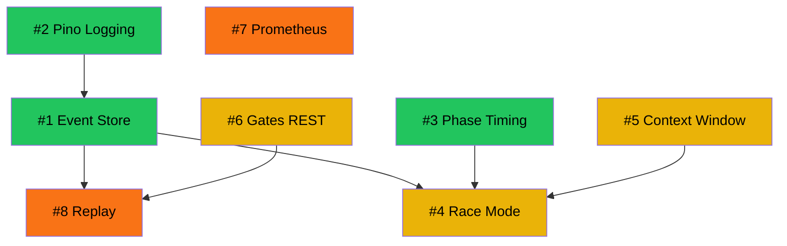

# Observability Deep Dive: pi-pp-platform × disler/pi-agent-observability

## Current State Assessment

### What You Already Have (Strengths)

Your platform has a **surprisingly rich, custom-built observability system** — more comprehensive than many production agent platforms. Here's what's already working:

| Capability | Implementation | Quality |
|---|---|---|
| **Event bus** | 35 typed events, per-run monotonic sequencing, ring buffer (2048 frames) | ⭐⭐⭐⭐ |
| **SSE streaming** | Global + per-run streams with Last-Event-ID resume, 15s heartbeat | ⭐⭐⭐⭐ |
| **Cost tracking** | Per-attempt `tokens_in/out`, `cost_usd`, `wall_ms`; UPSERT budget scopes | ⭐⭐⭐⭐⭐ |
| **Budget enforcement** | Warn/block tripwires, multi-scope (run/day/model/tier) | ⭐⭐⭐⭐⭐ |
| **Run Observatory UI** | 3-column live view with phase timeline, attempt grid, gate feed, log pane | ⭐⭐⭐⭐ |
| **Mission Control UI** | Fleet dashboard with KPI strip, attention lane, active runs grid | ⭐⭐⭐⭐ |
| **Phase lifecycle events** | All 9 pilot phases emit `run.context` with phase identifiers | ⭐⭐⭐ |
| **SQLite schema** | 11 observability tables covering runs, stages, attempts, verdicts, budgets, TDD, artifacts, missability, evolution | ⭐⭐⭐⭐⭐ |
| **Error taxonomy** | Typed errors (`JudgeUnavailableError`, `TierResolutionError`, `PilotInternalError`) with cascading failure handling | ⭐⭐⭐ |
| **Secret scrubbing** | `scrubSecrets()` filters API keys and absolute paths from UI | ⭐⭐⭐⭐ |

### What disler/pi-agent-observability Does

The external repo implements a **lightweight, self-hosted, real-time agent monitoring system**:

```
Agent Hooks → Python Script → HTTP POST → Bun/TS Server → SQLite → WebSocket → Vue 3 Dashboard
```

**Core philosophy:** "Dead simple" — event sourcing into SQLite with real-time push to a dashboard, zero external SaaS. Key features:

- **Hook-based instrumentation** — lifecycle hooks intercept every tool call and session event without modifying agent code
- **Persistent event store** — all events written to SQLite (WAL mode) for historical analysis
- **Race Mode** — side-by-side comparison of agent runs with different configurations
- **Per-turn cost attribution** — tokens, cost, TPS per model turn
- **Context window usage tracking** — monitors context consumption to identify bloat
- **Multi-agent swim lanes** — visualize parallel agent execution

---

## Gap Analysis

Comparing your platform against disler's patterns and general observability best practices:

| Gap | Severity | Impact |
|---|---|---|
| **No persistent event log** — events are in-memory ring buffer only (max 2048), lost on restart | 🔴 Critical | Can't debug completed/crashed runs after the fact |
| **No structured server logging** — Fastify logger is `false`, only 1 `console.warn` in entire backend | 🔴 Critical | Zero server-side audit trail for ops issues |
| **No phase-level timing** — `wall_ms` per attempt, but no timing for triage/profile/taxonomy/missability/master-plan | 🟡 High | Can't identify slow phases or bottlenecks |
| **No run comparison** — no way to compare runs side-by-side | 🟡 High | Can't optimize model/config tradeoffs empirically |
| **No context window tracking** — no visibility into context consumption per attempt | 🟡 High | Silent context bloat degrades quality |
| **No gates REST endpoint** — `tdd_checks`, `artifact_validations` only via SSE replay | 🟡 Medium | Deferred in handoff.md Phase 4 |
| **No ops metrics** — no Prometheus, no request latency, no SSE connection count, no queue depth | 🟡 Medium | Ops flying blind on server health |
| **No error tracking service** — no Sentry/equivalent integration | 🟡 Medium | Crashed runs require manual investigation |
| **No correlation IDs** — only `run_id` in SSE; no request-scoped tracing | 🟠 Low-Med | Hard to trace cross-layer issues |
| **No OpenTelemetry** — no spans/traces for distributed observability | 🟠 Low | Not critical for single-server, but limits integration |

---

## Top 8 Opportunities — Ranked by Impact/Effort

---

### 🏆 Opportunity 1: Persistent Event Store

> **Impact: 🔴 Critical | Effort: Medium | Priority: #1**

**The problem:** Your 2048-frame ring buffer means all observability events evaporate on server restart or when the buffer wraps. You can't debug a crashed run from 2 hours ago. You can't analyze patterns across hundreds of runs. disler's system persists *everything* to SQLite — and you already have SQLite as your primary store.

**What to build:**

An `events` table that captures every SSE event with its full payload, enabling historical replay, debugging, and analytics.

#### Implementation Plan

| Step | File(s) | Details |
|---|---|---|
| 1. Schema | `packages/core/src/db/schema.sql` | Add `CREATE TABLE IF NOT EXISTS events (id INTEGER PRIMARY KEY, run_id TEXT, event_type TEXT NOT NULL, payload TEXT NOT NULL, seq INTEGER, ts TEXT NOT NULL DEFAULT (strftime('%Y-%m-%dT%H:%M:%fZ','now')))` + indexes on `(run_id, seq)` and `(event_type, ts)` |
| 2. Writer | `packages/server/src/bus.ts` | Add a `persistFrame()` call inside `publish()` that INSERT's each frame to the `events` table. Use WAL mode + batched writes (accumulate for 100ms, then bulk INSERT) to avoid write contention |
| 3. Query helpers | `packages/core/src/orchestrator/runs.ts` | Add `getEventLog(runId, {since?, type?, limit?})` query function |
| 4. REST endpoint | `packages/server/src/routes/events.ts` | Add `GET /api/v1/runs/:id/event-log?since=&type=&limit=` returning paginated historical events |
| 5. Wire contract | `shared/api-types.ts` | Add `EventLogEntry` type and `apiPaths.runEventLog` |
| 6. UI replay | `ui/src/stores/liveRunStore.ts` | For completed runs, hydrate from `GET /event-log` instead of SSE |
| 7. Retention | New janitor task | Add configurable retention (e.g., 30 days) to the existing janitor |

**Estimated LOC:** ~250 backend, ~80 UI, ~30 schema

---

### 🏆 Opportunity 2: Structured Logging with Pino

> **Impact: 🔴 Critical | Effort: Low | Priority: #2**

**The problem:** Fastify logger is `false`. There is literally one `console.warn` in the entire backend. When something goes wrong operationally (database lock, SSE disconnect, route error), there is *no record of it happening*.

**What to build:**

Enable Fastify's built-in Pino logger with structured JSON output, request correlation IDs, and run-scoped log enrichment.

#### Implementation Plan

| Step | File(s) | Details |
|---|---|---|
| 1. Enable Pino | `packages/server/src/app.ts` | Change `logger: false` → `logger: { level: process.env.LOG_LEVEL ?? 'info', serializers: { ... } }`. Fastify uses Pino natively — zero new deps |
| 2. Request IDs | `packages/server/src/app.ts` | Fastify generates `request.id` automatically; add `genReqId` to use run_id when available |
| 3. Run-scoped logging | `packages/server/src/supervisor.ts` | Create child loggers per run: `const log = req.log.child({ runId })` — all supervisor log lines get automatic run context |
| 4. Key lifecycle logs | Multiple server files | Add `log.info` at run start/end, budget tripwire, SSE connect/disconnect, error catches. Replace the single `console.warn` |
| 5. Sensitive redaction | Pino config | Configure Pino redaction paths for provider keys: `redact: ['req.headers.authorization', '*.apiKey']` |
| 6. Log rotation | Env config | Pipe to `pino-roll` or rely on systemd journal in production |

**Estimated LOC:** ~60 total. Pino is already a Fastify transitive dep — literally zero new packages.

---

### 🏆 Opportunity 3: Phase-Level Timing & Performance Profiling

> **Impact: 🟡 High | Effort: Low | Priority: #3**

**The problem:** You track `wall_ms` per attempt, but the 9 pilot phases (triage, profile, taxonomy, stage loop, missability, master-plan, finalize) have no persisted timing. The UI reconstructs phase timing from SSE event timestamps — which are lost when events expire. You can't answer "why did this run take 12 minutes?" or "is taxonomy consistently slow?"

**What to build:**

Add `started_at` / `finished_at` / `wall_ms` to phase tracking, persisted to a new `phases` table or embedded in the `runs` table as JSON.

#### Implementation Plan

| Step | File(s) | Details |
|---|---|---|
| 1. Phase timing | `packages/pilot/src/run-pilot.ts` | Wrap each phase in a `const t0 = performance.now()` / `emit('phase.completed', { phase, wall_ms: performance.now() - t0 })` pattern |
| 2. New event type | `packages/pilot/src/events.ts` | Add `phase.completed` to the `PilotEvent` union with `{ phase: RunPhase, wall_ms: number }` |
| 3. Schema option A | `packages/core/src/db/schema.sql` | Add `phases` table: `run_id, phase, started_at, finished_at, wall_ms` |
| 4. Schema option B | `packages/core/src/orchestrator/runs.ts` | Store as `phase_timings_json` column on the `runs` table (simpler, avoids new table) |
| 5. Wire contract | `shared/api-types.ts` | Add `PhaseTiming` type, include in `RunRow` response |
| 6. UI visualization | `ui/src/features/observability/RunObservatoryPage.tsx` | Enhance `PhaseTimeline` with actual duration bars (Gantt-style) instead of just status dots |

**Estimated LOC:** ~100 backend, ~60 UI

---

### 🏆 Opportunity 4: Run Comparison / Race Mode

> **Impact: 🟡 High | Effort: Medium-High | Priority: #4**

**The problem:** You have no way to empirically compare runs. When you change models, adjust rubric strictness, swap team profiles, or modify gate thresholds — you can't see the before/after impact. disler's "Race Mode" shows side-by-side agent runs comparing cost, speed, quality, and token usage.

**What to build:**

A comparison view that lets you select 2–4 runs and see them side-by-side across key dimensions.

#### Implementation Plan

| Step | File(s) | Details |
|---|---|---|
| 1. Comparison data endpoint | New route | `GET /api/v1/runs/compare?ids=a,b,c` returning normalized comparison data: per-run totals (cost, tokens, wall time, stages, verdicts, reflexions) |
| 2. Wire contract | `shared/api-types.ts` | Add `RunComparisonResponse` type with per-run metrics |
| 3. Comparison page | New UI page | `/runs/compare?ids=a,b,c` with: |
|   |   | • **Summary cards:** total cost, tokens, duration, stages, pass rate per run |
|   |   | • **Stage-by-stage table:** aligned stages with cost/tokens/verdict per run |
|   |   | • **Cost waterfall chart:** stacked bar chart of per-stage cost per run |
|   |   | • **Model usage breakdown:** which models used where, at what cost |
| 4. Run picker | UI component | Multi-select from run list with "Compare Selected" button |
| 5. Shareable URLs | URL params | Comparison state in query params for bookmarking |

**Estimated LOC:** ~200 backend, ~400 UI

---

### 🏆 Opportunity 5: Context Window Usage Tracking

> **Impact: 🟡 High | Effort: Medium | Priority: #5**

**The problem:** You track `tokens_in` per attempt, but you don't track cumulative context consumption across turns within a coding session. An agent might hit 80% of its context window by turn 3 and degrade silently. disler's system explicitly tracks context window fill percentage.

**What to build:**

Track and surface context window utilization as a percentage of model's max context, per attempt and across the stage lifecycle.

#### Implementation Plan

| Step | File(s) | Details |
|---|---|---|
| 1. Context tracking | `packages/engine/src/envelope.ts` | Add `context_used_tokens` and `context_max_tokens` to `GenResult` (from pi usage data or model catalog) |
| 2. Catalog enhancement | `packages/core/catalog.json` | Ensure `context_window` is present for all models (many already have it) |
| 3. Event enrichment | `packages/pilot/src/phases/stage-loop.ts` | Include `context_pct` in `attempt.completed` events |
| 4. Wire contract | `shared/api-types.ts` | Add `context_used_tokens`, `context_max_tokens`, `context_pct` to `AttemptRow` |
| 5. DB schema | `packages/core/src/db/schema.sql` | Add `context_used`, `context_max` columns to `attempts` |
| 6. UI indicator | `ui/src/features/observability/RunObservatoryPage.tsx` | Context fill meter in the `AttemptMetaGrid` — green/yellow/red based on % |
| 7. Alerting | `packages/server/src/supervisor.ts` | Emit `context.warning` event when context exceeds 75% — similar pattern to budget tripwires |

**Estimated LOC:** ~120 backend, ~80 UI

---

### 🏆 Opportunity 6: Gates REST Endpoint & History

> **Impact: 🟡 Medium | Effort: Low | Priority: #6**

**The problem:** `tdd_checks` and `artifact_validations` are recorded in SQLite but have no REST surface. The only way to see gate history is via SSE event replay, which is ephemeral. This is already identified in `handoff.md` Phase 4 as deferred work.

#### Implementation Plan

| Step | File(s) | Details |
|---|---|---|
| 1. Query helpers | `packages/core/src/orchestrator/runs.ts` | Add `getGateHistory(runId)` → union of TDD checks, artifact validations, verdicts, smoke results ordered by timestamp |
| 2. REST endpoint | New route file | `GET /api/v1/runs/:id/gates` returning unified gate history |
| 3. Wire contract | `shared/api-types.ts` | Add `GateHistoryEntry` discriminated union type + `apiPaths.runGates` |
| 4. UI panel | `ui/src/features/observability/RunObservatoryPage.tsx` | Enhance `GateFeed` to load from REST for completed runs (currently SSE-only) |

**Estimated LOC:** ~100 backend, ~40 UI

---

### 🏆 Opportunity 7: Ops Metrics Endpoint (Prometheus-Compatible)

> **Impact: 🟡 Medium | Effort: Medium | Priority: #7**

**The problem:** No visibility into server health — concurrent run count, SSE connection count, request latency percentiles, error rates, queue depth. You're ops-blind.

#### Implementation Plan

| Step | File(s) | Details |
|---|---|---|
| 1. Metrics registry | New file `packages/server/src/metrics.ts` | Create a lightweight counter/gauge/histogram registry (or use `prom-client`) |
| 2. Instrument server | Multiple server files | Track: `pp_active_runs` (gauge), `pp_sse_connections` (gauge), `pp_request_duration_seconds` (histogram), `pp_events_published_total` (counter), `pp_budget_tripwires_total` (counter by scope) |
| 3. Metrics endpoint | New route | `GET /metrics` in Prometheus exposition format |
| 4. Fastify hook | `packages/server/src/app.ts` | `onRequest`/`onResponse` hooks for request duration histogram |
| 5. SSE tracking | `packages/server/src/routes/events.ts` | Increment/decrement gauge on SSE connect/disconnect |

**Estimated LOC:** ~180 backend, 0 UI (Prometheus/Grafana consume this)

---

### 🏆 Opportunity 8: Run Replay & Time-Travel Debugging

> **Impact: 🟡 Medium | Effort: High | Priority: #8**

**The problem:** You already have `ReplayBundle` in your wire contract, but there's no UI to "replay" a completed run's events in real-time, stepping through phases and seeing exactly what happened. disler's system stores all events for full historical replay.

> **Note:** This opportunity depends on **Opportunity 1 (Persistent Event Store)** being implemented first.

#### Implementation Plan

| Step | File(s) | Details |
|---|---|---|
| 1. Replay endpoint | New route | `GET /api/v1/runs/:id/replay` returning all persisted events in chronological order |
| 2. Replay player | New UI component | `ReplayPlayer` with play/pause/speed controls, feeding events into `liveRunStore` at configurable speed |
| 3. Time scrubber | UI component | Timeline scrubber showing event density, clickable to jump to any point |
| 4. Diff overlay | UI component | Show file diffs at each attempt boundary |

**Estimated LOC:** ~100 backend, ~500 UI

---

## Implementation Priority Matrix

```
                    HIGH IMPACT
                        │
         ┌──────────────┼──────────────┐
         │  1. Event Store │ 4. Race Mode │
         │  2. Pino Logging│              │
         │  3. Phase Timing│              │
    LOW  │  5. Context Win │              │  HIGH
   EFFORT├──────────────┼──────────────┤ EFFORT
         │  6. Gates REST  │ 8. Replay    │
         │                 │ 7. Prometheus │
         │                 │              │
         └──────────────┼──────────────┘
                        │
                    LOW IMPACT
```

## Recommended Execution Order

> **Important:** Opportunities 1–3 are "no-brainer" improvements: high impact, low-medium effort, filling critical gaps. I'd recommend doing them as a single sprint.

| Phase | Opportunities | Rationale |
|---|---|---|
| **Sprint 1** (Foundation) | **#2 Pino Logging** → **#1 Event Store** → **#3 Phase Timing** | Logging first (trivial), then event persistence (enables everything else), then phase timing (small, high value) |
| **Sprint 2** (Insights) | **#5 Context Window** → **#6 Gates REST** → **#4 Race Mode** | Context tracking surfaces hidden quality issues; gates fills a known gap; race mode enables data-driven optimization |
| **Sprint 3** (Ops & Debug) | **#7 Prometheus Metrics** → **#8 Replay** | Ops readiness, then the crown jewel of debugging |

## Dependency Graph



🟢 Green = Sprint 1 | 🟡 Yellow = Sprint 2 | 🟠 Orange = Sprint 3

---

## Key Architectural Decision

> **Warning: Build vs. Integrate with disler's system?**
>
> disler's system uses a **Python hook → HTTP → Bun server → Vue dashboard** architecture that is fundamentally different from your stack (TypeScript monorepo, Fastify, React, existing SSE infrastructure). **Porting the architecture doesn't make sense** — you already have the harder parts built (event bus, SSE, SQLite, React UI). What makes sense is **adopting the patterns** (persistent event store, race mode, context tracking) while building them natively into your existing infrastructure.
>
> The one exception: if you ever want to observe *external* agents (Claude Code, Cursor, etc.) alongside pi-pp runs, disler's hook pattern becomes relevant as a data ingestion adapter.

---

## What You DON'T Need

For completeness, here are things that came up in research that I'd recommend **against**:

| Skip | Why |
|---|---|
| **OpenTelemetry** | Overkill for a single-server system. Your event bus already provides richer semantics than generic spans. Revisit only if you go multi-service. |
| **External SaaS (Datadog, LangSmith, Langfuse)** | Your custom system already has better domain-specific semantics. These tools would add cost and complexity without proportional value. |
| **Full distributed tracing** | You're single-process. Correlation via `run_id` + `stage_id` + `attempt_id` is sufficient. |
| **Log aggregation (ELK)** | Pino to stdout + log rotation is enough at current scale. |
